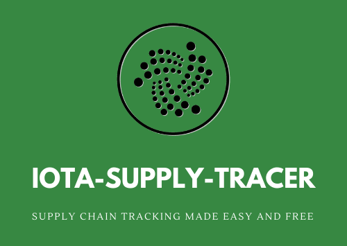

# Iota Supply Tracer


The IOTA-SUPPLY-TRACER is a **proof of concept** to demonstrate how easy it can be to build a **supply chain tracking solution on the IOTA tangle**.  
Using the library is possible to easy create a new product which state is monitored and updated via messages stored on the IOTA tangle.  
The main advantage of using iota (instead of any other blockchain) is the complete lack of fees, which allows both supplier and user goods to easly use the decentralized ledger to read and update status **without any cost**.

## Table of Contents
  - [How does it work](#how-does-it-work) 
    - [Suppliers identification](#suppliers-identification)
  - [Dependencies](#dependencies)
  - [Installation](#installation)
  - [Usage](#usage)
  - [FAQs](#faqs)
    - [Entity verification](#how-can-an-address-be-verified-to-be-owned-by-an-entity?)
  - [Contributing](#contributing)
  - [License](#license)

  How can an address be verified to be owned by an entity?

## How does it work

### Suppliers identification
Each message published on the tangle by a supplier is signed with a cryptographic signature in the *signature* property. And is also marked with a *entity* property containing the address of the signing entity.

The address in the *entity* property is the iota wallet address where the complete certificate of the specific identity is published. Any user simply by checking which is the last transaction in that specified address can find the certificate of that identity.

Once the certificate is retreived, the original message can be verified using the public key contained in the certificate.  

### Chain of custody

TODO

## Dependencies

You need [Node.js](https://nodejs.org/en/) installed on your machine. 
All package dependencies are handled by npm and lerna.

## Installation

Clone repo locally:
```bash
git clone https://github.com/danipisca07/iota-supply-tracer
cd iota-supply-tracer
```
Install all dependencies in one command:
```bash
npx lerna bootstrap
```
## Usage
The library can be used by the two packages inside the packages folder:  
- Supplier: Package used by the suppliers of products to:  
    - Create new product
    - Update status/location of a product
    - Transfer custody of a product to another supplier
    - Transfer custody of a product to the end-user
- User: Package used by end-user of products to:
    - Verify chain of custody of received product
    - Confirm reception of product

Example usage:
```js
//Product creation
const supplier = new Supplier();
await supplier.init();
const product = await supplier.newProduct();

//Transfer of product custody to intermediary
const intermediary = new Supplier();
await intermediary.init();
await supplier.transferProduct(product, intermediary.getCurrentCertificate());

//Transfer of product custody to end-user
await intermediary.transferProductToEndUser(product);

//Verify and confirm product reception
const user = new User();
const productChain = await user.getSupplyChain(product);
const verified = await user.verifyChain(productChain);
if(verified)
    await user.confirmProduct(product);
```

For a complete example see [test.js](test.js).

## FAQs

### How can an address be verified to be owned by an entity?

One the IOTA tangle each address is owned by whomever owns the private key connected to that specific address (the public key). So how can an user be sure that a specific entity address is really who that entity claims to be?

This problem lies outside of what the iota tangle addresses, this means that it must be solved using some external verification method. The solution implemeted is using a website to verify an entity address. To this purpose, inside each certificate of each entity a *website* property is present. This property can be used by any user to verify 

## Contributing
Pull requests are welcome. For major changes, please open an issue first to discuss what you would like to change.

Please make sure to update tests as appropriate.

## License
[GPL-3.0](https://choosealicense.com/licenses/gpl-3.0/)